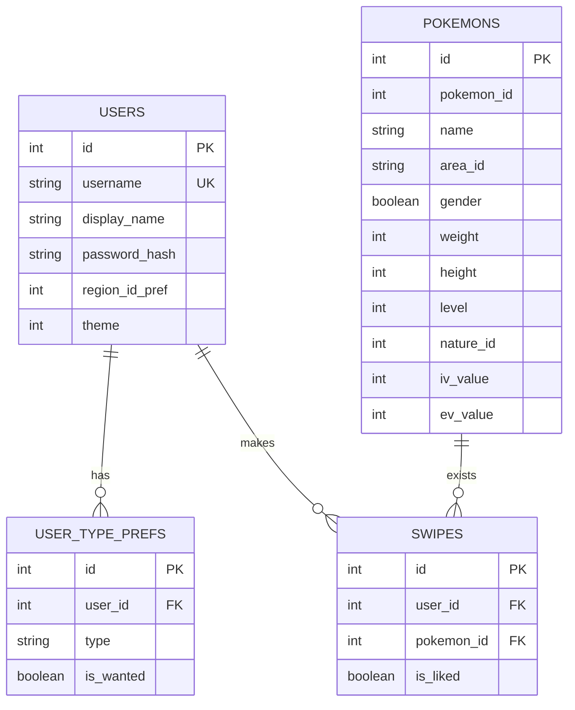
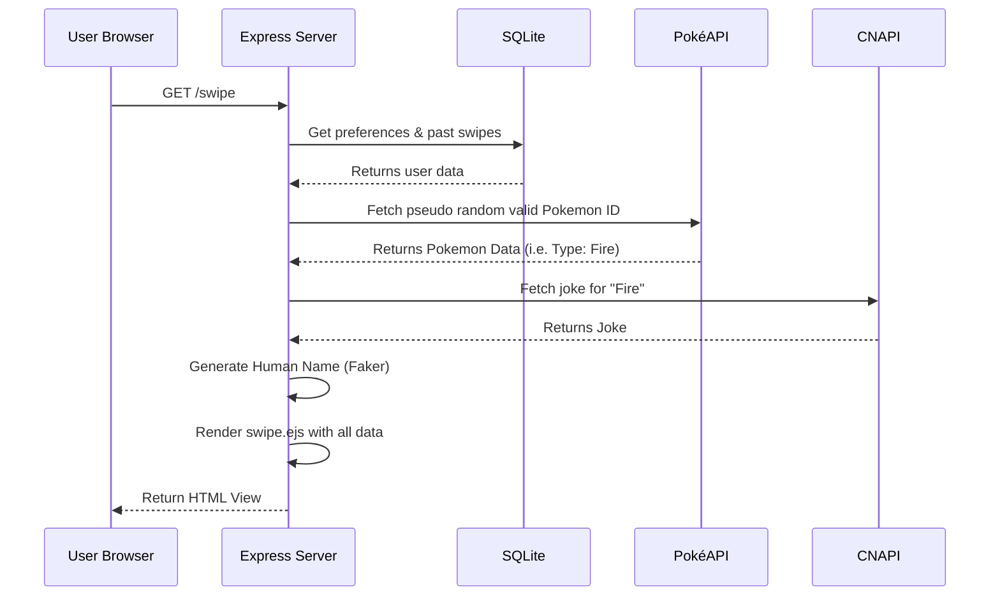

# DexMatch
A dating app for Pokémon to find their true mate.

### Overview

1. [Building](#building)
    1. [Prerequisites](#prerequisites)
    2. [How to Run the App](#how-to-run-the-app)
    3. [Running Tests](#running-tests)

2. [Architecture](#architecture)
    1. [The stack](#the-stack)
    2. [System Context Diagram](#system-context-diagram)
    3. [Entity-Relationship Diagram](#entity-relationship-diagram)
    4. [Sequence Diagram](#sequence-diagram)
    5. [Testing Strategy](#testing-strategy)

3. [Future Improvements](#future-improvements)

## Building

### Prerequisites
* Node.js (v18 or higher)
* NPM (Node Package Manager)

 

### How to Run the App (Local Development)
1. Clone this repository to your local machine.
2. Open your terminal and navigate to the project folder: `cd dexmatch`
3. Install the dependencies: `npm install`

 

#### Development Mode:
This mode uses `ts-node` and `nodemon` to automatically restart the server when files change.
1. Run: `npm run dev`
2. Open your web browser and go to: `http://localhost:3000`

 

#### Production Mode:
This mode compiles the TypeScript code into optimized JavaScript before running.
1. Compile the code: `npm run build`
2. Start the server: `npm start`
3. Open your web browser and go to: `http://localhost:3000`

*Note: The database uses SQLite. You do not need to install or configure any external database servers. A local database file will be created automatically upon launch.*

 

### Running Tests
The project uses **Jest** and **Supertest** to perform integration testing. These tests verify that the server boots correctly, routes are accessible, and the EJS engine renders the expected content.

1. Ensure dependencies are installed: `npm install`
2. Run the test suite: `npm test`

*Note: The tests use a decoupled version of the Express app, allowing them to run without interfering with a live server instance.*

## Architecture

### The stack
This application is built using a Server-Side Rendered (SSR) architecture following the Model-View-Controller (MVC) design pattern.

**Core Backend**
* **[Node.js](https://nodejs.org/) & [Express.js](https://expressjs.com/):** The core web framework used to handle routing, HTTP requests, and server logic.
* **[Axios](https://axios-http.com/):** A promise-based HTTP client used in the service layer to fetch and parse external API data cleanly.
* **[Faker.js](https://fakerjs.dev/):** Used to generate random, localized human names for the Pokémon to enhance the "Tinder" theme.
* **[Jest](https://jestjs.io/) & [Supertest](https://github.com/ladjs/supertest):** Testing framework and library used for integration testing to ensure routes and server logic remain reliable.

**Frontend / Views**
* **[EJS (Embedded JavaScript)](https://ejs.co/):** The templating engine used to inject dynamic server data (Pokémon stats, jokes, user preferences) directly into HTML layouts before sending them to the client.
* **[Tailwind CSS](https://tailwindcss.com/) & [DaisyUI](https://daisyui.com/):** Used via CDN to provide a modern, highly polished, and responsive user interface without requiring a complex frontend build pipeline.

**Database & Security**
* **[SQLite3 (better-sqlite3)](https://github.com/WiseLibs/better-sqlite3):** A fast, local, serverless SQL database. Chosen specifically so reviewers can run the application immediately without external database configuration.
* **[Bcrypt.js](https://www.npmjs.com/package/bcryptjs):** Used to securely salt and hash user passwords before storing them in the database.
* **[Express-Session](https://www.npmjs.com/package/express-session):** Handles user session management and authentication state.

**External APIs**
* **[PokeAPI](https://pokeapi.co/):** Provides *all the Pokémon data you'll ever need in one place*.
* **[Chuck Norris API](https://api.chucknorris.io/):** Provides the thematic jokes based on Pokémon typing.

### System Context Diagram
A high-level overview of the business requirements.

### Entity-Relationship Diagram
How the database tables relate to each other.

### Sequence Diagram
Maps out the data flow and orchestration for the core swipe action. It details the step-by-step sequence of internal SQLite queries and external API fetches required to render the next view.

### Testing Strategy
To ensure the application is reliable and maintainable, I implemented an integration testing suite:

* **Decoupled Architecture:** The Express application logic is separated into `src/app.ts`, while the server listener resides in `src/server.ts`. This allows the testing suite to execute the app in-memory without binding to a network port.
* **Route Verification:** Tests simulate real HTTP requests to verify that critical paths (like Login and Swipe) return the correct status codes and UI elements.

## Future Improvements
Given more time, here are the features and technical enhancements I would prioritize to take this application to the next level:

### User Experience & UI Polish
* **UI Animations:** Implement swipe-left/swipe-right card animations to mimic the native Tinder experience.
* **Actual Pokémon Cards:** Make the match cards look and feel like physical Pokémon trading cards. This would include a highly visual front side and a flippable back side containing their stats.
* **Sound On Encounter:** Enhance the immersion by playing the specific Pokémon's in-game audio cry as their card is uncovered.

### Core Features & Functionality
* **Advanced Filtering:** Allow users to filter Pokémon by specific generations, weight classes, or base stats (expanding beyond just region and type).
* **Smart Matching Engine:** Optimize the generation logic by storing previously surfaced Pokémon in the database. Subsequent users would then experience a weighted chance of encountering an existing, database-cached Pokémon versus generating a completely new one.
* **Multi-Language Support (i18n):** Add localization options allowing users to change the language of the application interface.
* **404-Page:** There is currently no 404-end point for the user.
* **A Chat:** There should be a chat where the user can "chat" with a Pokémon and get multiple choice questions. Given the nature and type of the pokémon, the answer should change if the pokémon finds you more or less favorable.
 
### Architecture & Performance
* **Caching Layer:** Introduce an in-memory cache (or Redis) for PokéAPI and Chuck Norris API responses to reduce network latency and prevent rate-limiting on popular queries.
* **Robust Authentication:** Replace the current session management with JWT (JSON Web Tokens) to make the authentication more stateless and scalable.
