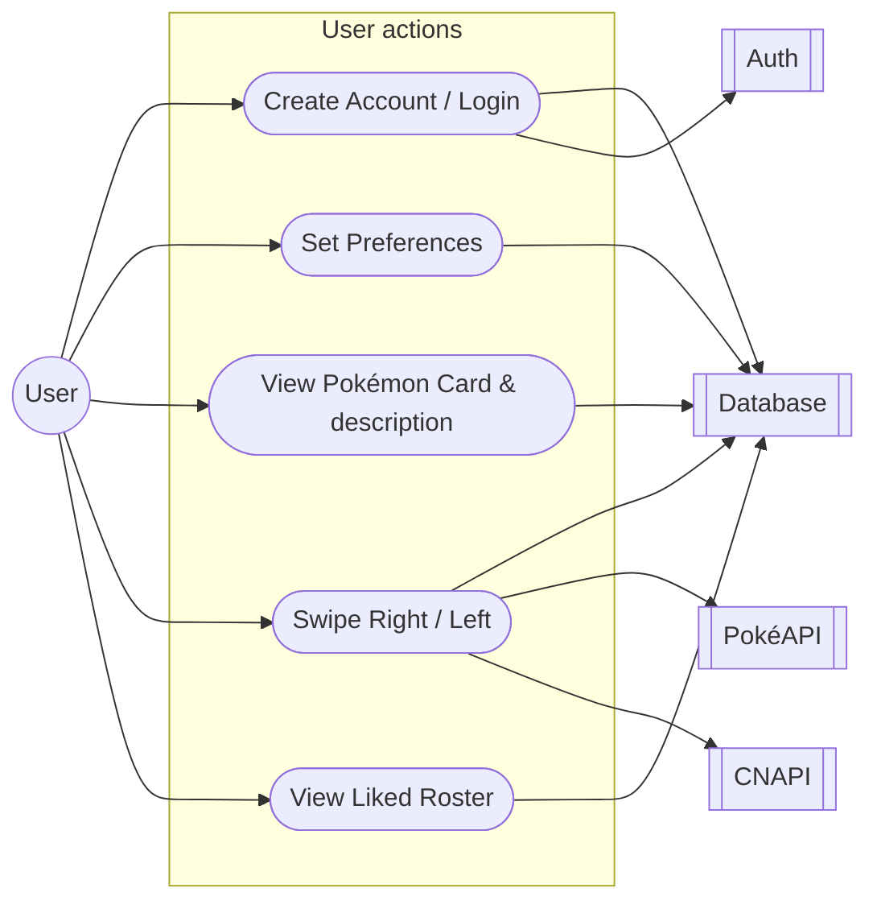
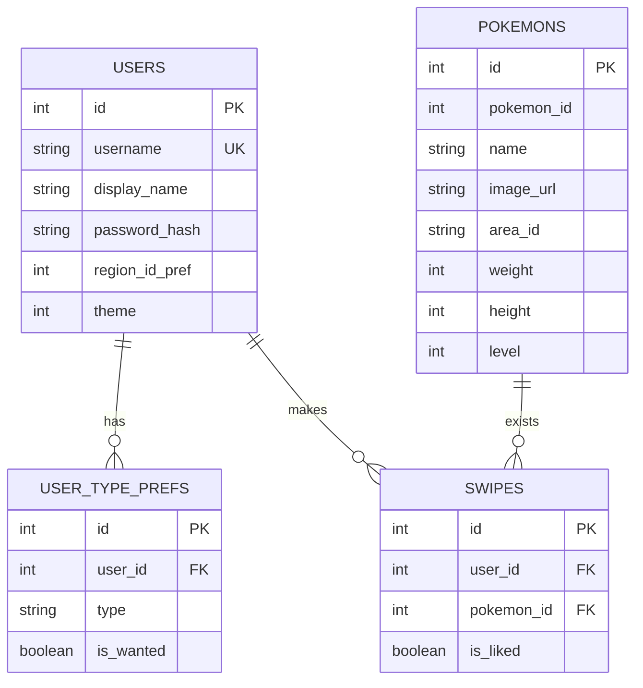
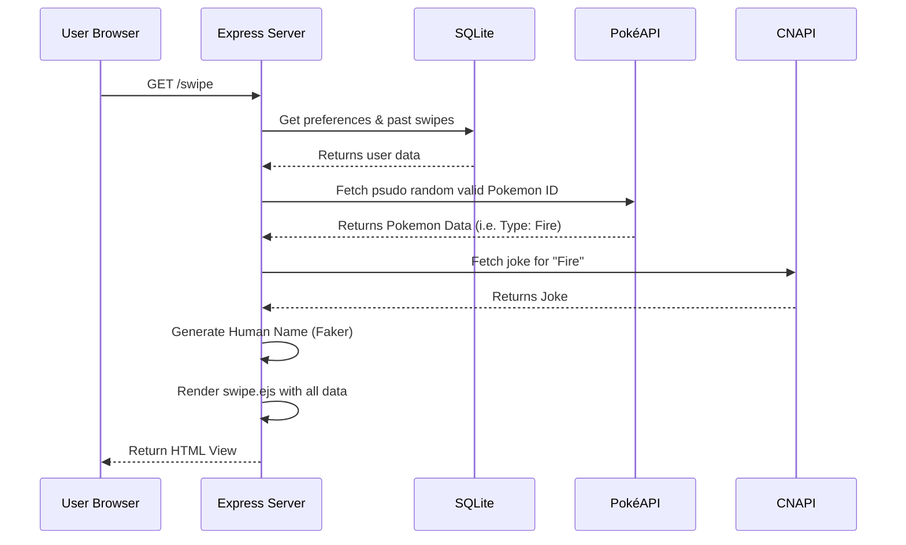

# DexMatch
A dating app for Pokémon to find their true mate.

## Overview

1. [Building](#building)
    1. [Prerequisites](#prerequisites)
    2. [How to Run the App](#how-to-run-the-app)

2. [Architecture](#architecture)
    1. [The stack](#the-stack)
    2. [System Context Diagram](#system-context-diagram)
    3. [Entity-Relationship Diagram](#entity-relationship-diagram)
    4. [Sequence Diagram](#sequence-diagram)

## Building

### Prerequisites
* Node.js (v18 or higher)
* NPM (Node Package Manager)

### How to Run the App (Local Development)
1. Clone this repository to your local machine.
2. Open your terminal and navigate to the project folder: `cd dexmatch`
3. Install the dependencies: `npm install`

**To run in Development Mode (Recommended for testing):**
This mode uses `ts-node` and `nodemon` to automatically restart the server when files change.
1. Run: `npm run dev`
2. Open your web browser and go to: `http://localhost:3000`

**To run in Production Mode:**
This mode compiles the TypeScript code into optimized JavaScript before running.
1. Compile the code: `npm run build`
2. Start the server: `npm start`
3. Open your web browser and go to: `http://localhost:3000`

*Note: The database uses SQLite. You do not need to install or configure any external database servers. A local database file will be created automatically upon launch.*

## Architecture

### The stack
This application is built using a Server-Side Rendered (SSR) architecture following the Model-View-Controller (MVC) design pattern.

**Core Backend**
* **[Node.js](https://nodejs.org/) & [Express.js](https://expressjs.com/):** The core web framework used to handle routing, HTTP requests, and server logic.
* **[Axios](https://axios-http.com/):** A promise-based HTTP client used in the service layer to fetch and parse external API data cleanly.
* **[Faker.js](https://fakerjs.dev/):** Used to generate random, localized human names for the Pokémon to enhance the "Tinder" theme.

**Frontend / Views**
* **[EJS (Embedded JavaScript)](https://ejs.co/):** The templating engine used to inject dynamic server data (Pokémon stats, jokes, user preferences) directly into HTML layouts before sending them to the client.
* **[Tailwind CSS](https://tailwindcss.com/) & [DaisyUI](https://daisyui.com/):** Used via CDN to provide a modern, highly polished, and responsive user interface without requiring a complex frontend build pipeline.

**Database & Security**
* **[SQLite3 (better-sqlite3)](https://github.com/WiseLibs/better-sqlite3):** A fast, local, serverless SQL database. Chosen specifically so reviewers can run the application immediately without external database configuration.
* **[Bcrypt.js](https://www.npmjs.com/package/bcryptjs):** Used to securely salt and hash user passwords before storing them in the database.
* **[Express-Session](https://www.npmjs.com/package/express-session):** Handles user session management and authentication state.

**External APIs**
* **[PokeAPI](https://pokeapi.co/):** Provides *all the Pokémon data you'll ever need in one place*.
* **[Chuck Norris API](https://api.chucknorris.io/):** Provides the thematic jokes based on Pokémon typing.

### Use Case Diagram
A high-level overview of the buisiness requirements.

  
### Entity-Relationship Diagram
How the database tables relate to each other.

### Sequence Diagram

